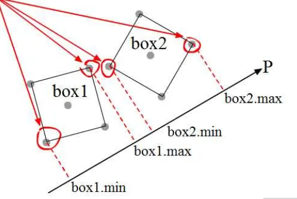
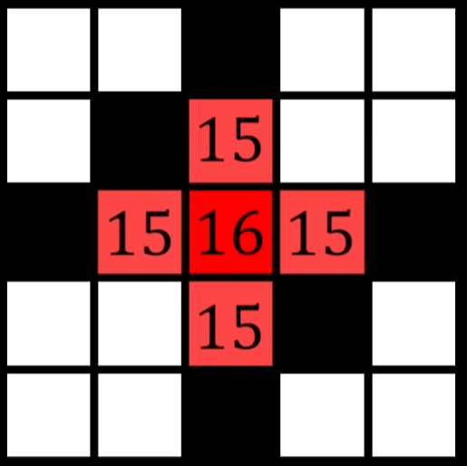
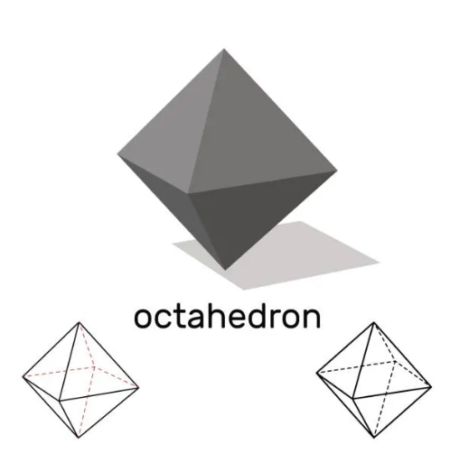
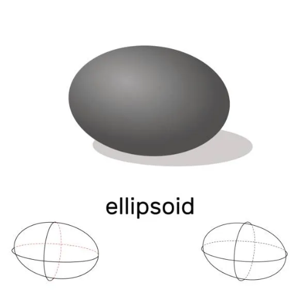
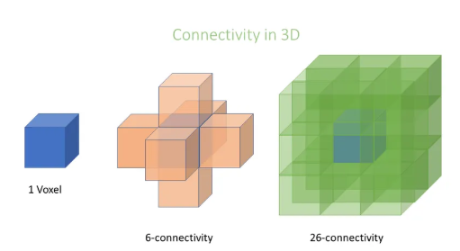
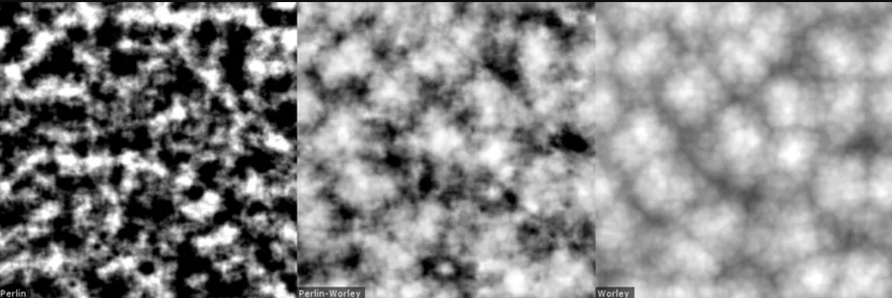
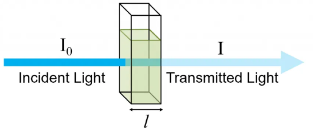
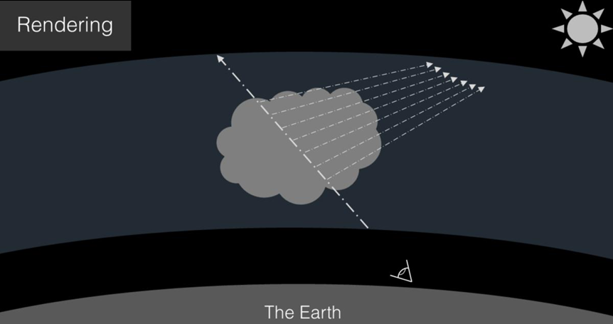
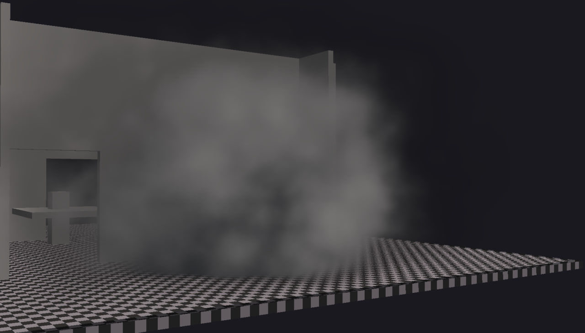

# Real-Time Volumetric Smoke Grenade Simulation using OpenGL 4.3 Compute Shaders

**Course:** 50.017 Graphics and Visualisation
**Institution:** Singapore University of Technology and Design (SUTD)

---

## Abstract

This report presents the design and GPU implementation of a real-time volumetric smoke grenade system in OpenGL 4.3/C++, reproducing the technique introduced by Valve in *Counter-Strike 2* (2023). The system combines four tightly-coupled subsystems: a Separating Axis Theorem (SAT) voxelizer that converts static scene geometry into a binary occupancy grid; a flood-fill propagation engine that expands a smoke density field outward from a detonation point while respecting wall boundaries; a Perlin-Worley noise volumetric renderer that integrates Beer-Lambert transmittance and Henyey-Greenstein scattering along each camera ray; and a simplified incompressible Navier-Stokes fluid solver that drives buoyancy, pressure projection, baroclinic torque, and semi-Lagrangian density advection. All subsystems execute as GPU compute shaders with no CPU readback during the render loop, enabling real-time performance on a desktop GPU.

---

## 1. Problem Statement

Smoke, fog, and fire belong to the class of *participating media*, materials that absorb, emit, and scatter light along a ray rather than only at a surface. Physically accurate simulation requires solving the Radiative Transfer Equation (RTE), which in its full form is intractable in real time (Chandrasekhar, 1960). Historically, real-time games have approximated smoke using billboarded 2D sprites or particle systems. These approaches are computationally cheap but fail to:

- **Occlude the scene correctly**: billboards are flat planes that clip through geometry
- **Interact with architecture**: sprites pass through walls rather than being blocked
- **Exhibit volume**: the cloud has no interior structure or self-shadowing

Valve's *Counter-Strike 2* (2023) introduced a volumetric smoke system in which a grenade detonates and the smoke cloud correctly fills available room geometry, wraps around corners, and is blocked by doors and walls. A public recreation of this technique (Gunnell, 2023) established an accessible blueprint using Unity compute shaders.

This project ports that system to standalone **OpenGL 4.3/C++**, implementing every subsystem from scratch. The core challenge is threefold:

1. **Geometry interaction**: smoke must not penetrate walls; it must route through doorways and fill rooms up to their geometric boundaries.
2. **Visual plausibility**: the rendered cloud must exhibit volumetric self-shadowing, forward scattering, and noise-driven turbulent detail at interactive frame rates.
3. **Physical motion**: the smoke must rise due to buoyancy, deflect off walls, and exhibit rotational instabilities at hot/cold boundaries, all driven by a GPU fluid solver.

---

## 2. Approach

### 2.1 System Architecture

The system is structured as a sequence of GPU compute shader passes executed each frame. Figure 1 illustrates the overall pipeline.

```
                        ┌─────────────────────────────────┐
                        │         STARTUP (once)          │
                        │  SAT Voxelizer → Wall SSBO      │
                        └────────────────┬────────────────┘
                                         │
                        ┌────────────────▼────────────────┐
                        │         PER-FRAME LOOP          │
                        │                                 │
                        │  1. Flood Fill (N steps/frame)  │
                        │     BFS propagation through     │
                        │     air voxels, blocked by      │
                        │     wall SSBO                   │
                        │              │                  │
                        │  2. Inject Density + Temp       │
                        │     from flood fill into        │
                        │     smoke/velocity SSBOs        │
                        │              │                  │
                        │  3. Fluid Solver Step           │
                        │     ├─ Advect velocity + temp   │
                        │     ├─ Apply buoyancy + gravity │
                        │     │    + baroclinic torque    │
                        │     ├─ Compute divergence       │
                        │     ├─ Pressure Jacobi (60×)    │
                        │     ├─ Project velocity         │
                        │     ├─ Advect smoke density     │
                        │     └─ Diffuse smoke density    │
                        │              │                  │
                        │  4. Noise Volume Update         │
                        │     Perlin-Worley FBM → 128³    │
                        │     3D texture                  │
                        │              │                  │
                        │  5. Depth Pre-pass              │
                        │     Render scene to depth FBO   │
                        │              │                  │
                        │  6. Volumetric Ray March        │
                        │     Beer-Lambert + HG phase +   │
                        │     shadow rays + noise erosion │
                        │     (half-resolution FBO)       │
                        │              │                  │
                        │  7. Bilateral Upsample          │
                        │     Depth-aware 2x2 filter:     │
                        │     low-res -> full-res FBO     │
                        │     (2 passes for quarter-res)  │
                        │              │                  │
                        │  8. Composite + Sharpen         │
                        │     Laplacian sharpen + over-   │
                        │     operator blend onto default │
                        │     FBO; transmittance from     │
                        │     bilateral alpha channel     │
                        └─────────────────────────────────┘
```

*Figure 1: Full system pipeline. Startup passes run once; per-frame passes run every render loop iteration.*

### 2.2 Data Representation

All volumetric data is stored on the GPU as Shader Storage Buffer Objects (SSBOs). No CPU readback occurs during the render loop. Table 1 summarises the key buffers.

**Table 1: GPU buffer layout**

| Buffer | Type | Size | Contents |
|---|---|---|---|
| Wall buffer | `int[]` | $N_x \cdot N_y \cdot N_z$ | 0 = air, 1 = opaque solid, 2 = invisible barrier |
| Flood fill ping/pong | `int[]` × 2 | $N_x \cdot N_y \cdot N_z$ | Integer BFS budget per voxel |
| Smoke density | `float[]` × 2 | $N_x \cdot N_y \cdot N_z$ | Normalised density $\in [0, 1]$ |
| Velocity + temperature | `vec4[]` × 2 | $N_x \cdot N_y \cdot N_z$ | `.xyz` = velocity, `.w` = temperature |
| Pressure | `float[]` × 2 | $N_x \cdot N_y \cdot N_z$ | Scalar pressure field |
| Noise volume | `GL_R16F` 3D texture | $128^3$ | Perlin-Worley FBM value |

All double-buffered resources use a ping-pong scheme: one buffer is the read source, the other the write destination, and they are swapped after each dispatch with a `glMemoryBarrier(GL_SHADER_STORAGE_BARRIER_BIT)`. This eliminates intra-pass read-write hazards.

The arena is initialised as a `96 × 32 × 96` voxel grid at a voxel size of `0.15` world units, giving a total arena footprint of approximately `14.4 × 4.8 × 14.4` world units. Grid dimensions and voxel size can be adjusted at runtime via the debug GUI; changes are staged and applied only when the user explicitly clicks **Rebuild Arena**, since rebuilding destroys and reinitialises all GPU buffers.

---

## 3. Implementation

### 3.1 Modelling the Arena: SAT Voxelization

#### 3.1.1 Motivation

For smoke to behave realistically, the simulation must know which voxels of the grid are solid. This converts the triangle mesh representation of the scene into a 3D binary occupancy grid. Table 2 compares three candidate approaches.

**Table 2: Voxelization method comparison**

| Method | Description | Limitation |
|---|---|---|
| Conservative GPU rasterization | Render mesh to 3 orthographic views | Misses thin triangles not axis-aligned; requires `GL_NV_conservative_raster` extension |
| Scanline z-parity fill | Cast rays along one axis; toggle at each surface crossing | Fills interiors, which is wrong for open rooms; requires a closed (manifold) mesh |
| **Triangle-AABB SAT** | Test each triangle against every voxel it overlaps | Correct for open meshes; no manifold assumption; parallelises over triangles |

The SAT approach is chosen because arena geometry is inherently open: rooms have no ceiling cap, doorways are unframed openings, and the arena perimeter is an invisible barrier rather than physical geometry. Z-parity fill would incorrectly mark room interiors as solid. SAT only marks surface-contact voxels, leaving air interiors free.

#### 3.1.2 The Separating Axis Theorem

The SAT states that two convex shapes are disjoint if and only if there exists at least one *separating axis*, a direction onto which both shapes' projected intervals do not overlap (Gottschalk, Lin & Manocha, 1996). For a triangle-AABB pair, there are exactly **13 candidate axes** to test. If any axis separates the shapes, they are disjoint and the voxel is empty.

**3 AABB face normals** (the three cardinal axes):

$$\hat{e}_x = (1,0,0), \quad \hat{e}_y = (0,1,0), \quad \hat{e}_z = (0,0,1)$$

**9 edge cross-product axes** (each triangle edge crossed with each cardinal axis):

$$\mathbf{a}_{ij} = \mathbf{e}_i \times \hat{e}_j, \qquad i \in \{0,1,2\},\; j \in \{x,y,z\}$$

where the triangle edges are:

$$\mathbf{e}_0 = v_1 - v_0, \qquad \mathbf{e}_1 = v_2 - v_1, \qquad \mathbf{e}_2 = v_0 - v_2$$

**1 triangle face normal:**

$$\mathbf{n} = \mathbf{e}_0 \times \mathbf{e}_1$$

For each candidate axis $\mathbf{a}$, the triangle is translated so the AABB centre is at the origin. The separation test then becomes:

$$p_i = \mathbf{a} \cdot v_i, \qquad r = h_x|a_x| + h_y|a_y| + h_z|a_z|$$

$$\text{separated} \iff \min(p_0,\,p_1,\,p_2) > r \quad \text{or} \quad \max(p_0,\,p_1,\,p_2) < -r$$

where $\mathbf{h} = (h_x, h_y, h_z)$ is the AABB half-extent (Schwarz & Seidel, 2010). A voxel is marked occupied only if all 13 axes show overlap, i.e., no separating axis was found. Figure 2 illustrates the axis separation test for one axis.



*Figure 2: Separating axis test. Two AABBs (box1 and box2) are projected onto a candidate axis P. Red arrows show each vertex being projected; box1.min/max and box2.min/max mark the projected intervals. When the intervals overlap on this axis, no separation is confirmed here, so all 13 axes must be tested. If any axis produces a gap between the intervals, the shapes are disjoint and the voxel is empty.*

#### 3.1.3 GPU Compute Implementation

The compute kernel dispatches **one thread per triangle**. Each thread:

1. Computes the triangle's AABB in voxel grid coordinates
2. Iterates over only the voxels that fall within that AABB, typically a small local set
3. Translates the triangle's vertices to each voxel's centre and runs the 13-axis test
4. On intersection: performs an atomic write (`atomicOr(voxels[idx], 1)`) to safely handle multiple triangles touching the same voxel in parallel

```glsl
ivec3 gMin = ivec3(floor((triMin - u_BoundsMin) / u_VoxelSize));
ivec3 gMax = ivec3(floor((triMax - u_BoundsMin) / u_VoxelSize));

for (int z = gMin.z; z <= gMax.z; z++)
for (int y = gMin.y; y <= gMax.y; y++)
for (int x = gMin.x; x <= gMax.x; x++) {
    vec3 center = u_BoundsMin + (vec3(x,y,z) + 0.5) * u_VoxelSize;
    if (triIntersectsAABB(v0 - center, v1 - center, v2 - center, halfExt))
        atomicOr(voxels[flatIdx(ivec3(x,y,z))], 1);
}
```


*Figure 2b: Voxel grid values mapped to game geometry. Left: a 2D slice of the voxel grid where 0 = air (white), 1 = opaque solid (bottom two rows), and 2 = invisible barrier (centre column). Right: the corresponding in-game representation, where value 1 renders as a solid floor/dirt surface, value 2 renders as a wall (wood texture), and value 0 is open air. Smoke propagation respects all non-zero voxels regardless of whether they are visible geometry.*

The voxel grid supports two wall types: **opaque solid** (value `1`, for physical walls and floors visible to the player) and **invisible barrier** (value `2`, for the arena perimeter boundary that blocks smoke without being rendered). This decouples the smoke boundary from the visual geometry.

**Table 3: Arena grid parameters and their effects**

| Parameter | Default | Effect of increasing | Effect of decreasing |
|---|---|---|---|
| Voxel size | `0.15` | Coarser geometry; lower memory; faster simulation | Finer wall detail and smoke boundary; higher memory cost |
| Grid X / Z | `96` | Larger horizontal arena footprint | Smaller playable area |
| Grid Y | `32` | Taller arena; more vertical smoke travel | Smoke hits ceiling sooner |

---

### 3.2 Modelling the Smoke: Flood Fill Propagation

#### 3.2.1 Role of the Flood Fill

Rather than injecting density directly into the fluid solver, a separate **flood fill** system acts as the persistent density source. This separation serves two purposes:

1. **Wall-aware propagation**: the BFS wavefront is naturally blocked by wall voxels, ensuring smoke can never appear behind a wall regardless of what the fluid solver does. The fluid solver can distort the density field arbitrarily; the flood fill continuously re-injects source density in only the reachable region.

2. **Robustness when advection is off**: when semi-Lagrangian advection is disabled via the debug GUI (a useful diagnostic mode), the flood fill alone still produces a plausible expanding smoke cloud, since it injects density directly into the density SSBO.

Figure 3 illustrates the two systems' relationship.



*Figure 3: BFS budget propagation in the flood fill. The dark red centre voxel holds budget 16 (the detonation source). Each of its four face-adjacent air neighbours receives budget 15 (= 16 − 1 hop cost). Black squares are wall voxels; the wavefront cannot enter them, so the budget never reaches the white air voxels beyond. Each propagation step decrements the budget by one hop, naturally limiting how far smoke can travel from the detonation point.*

#### 3.2.2 Temporal Growth Curve

On detonation, a seed budget $B(t)$ is stamped onto the detonation voxel each propagation step. This budget grows from 0 to $B_{max}$ over fill duration $T_f$ using a **cubic ease-out** curve:

$$B(t) = B_{max} \cdot \left(1 - \left(1 - \frac{t}{T_f}\right)^3\right)$$

Figure 4 compares the three candidate growth curves over the normalised interval $[0, 1]$: the chosen **cubic ease-out** $1-(1-t)^3$ (red), a **linear** ramp $t$ (blue), and a **square-root** curve $\sqrt{t}$ (green).


*Figure 4: Growth curve comparison. Red: cubic ease-out $1-(1-t)^3$ (chosen). Blue: linear $t$. Green: $\sqrt{t}$. The cubic ease-out rises steeply in the first quarter of its duration and then levels off, matching CS2 footage where the cloud fills most of the room within the first 1–2 seconds and then slowly presses into corners.*

**Table 4: Growth curve behaviour at key time points**

| $t / T_f$ | Cubic ease-out (red) | Linear (blue) | $\sqrt{t}$ (green) |
|---|---|---|---|
| 0.10 | 27.1% | 10.0% | 31.6% |
| 0.25 | 57.8% | 25.0% | 50.0% |
| 0.50 | 87.5% | 50.0% | 70.7% |
| 0.75 | 98.4% | 75.0% | 86.6% |
| 0.90 | 99.9% | 90.0% | 94.9% |

The cubic ease-out reaches 87.5% fill by the halfway point, matching CS2 footage where the grenade cloud fills most of the room within the first 1–2 seconds and then slowly presses into corners.

The maximum budget is set to:

$$B_{max} = \sqrt{2r_{xz}^2 + r_y^2} \cdot B_{seed} \cdot k_{detour}$$

where $r_{xz}$, $r_y$ are the ellipsoid radii in voxel units and $k_{detour} \geq 1$ provides extra budget for smoke to route around walls without dying in front of them.

#### 3.2.3 Ellipsoid Spatial Constraint

Smoke grenades expand in an oblate spheroidal volume, wider than tall, matching the characteristic shape of a ground-level detonation in CS2. An explicit ellipsoidal gate is applied: any voxel outside the ellipsoid is zeroed regardless of propagated budget:

$$\left(\frac{\Delta x}{r_{xz}}\right)^2 + \left(\frac{\Delta y}{r_y}\right)^2 + \left(\frac{\Delta z}{r_{xz}}\right)^2 \leq 1$$

An earlier attempt applied anisotropic decay (decrementing Y-neighbours by a larger step than XZ-neighbours). This produces the correct aspect ratio on average but results in **octahedral** iso-surfaces, as illustrated in Figure 5, because the underlying metric of 6-connected BFS is the L1 (Manhattan) distance which produces diamond cross-sections rather than ellipses.

| Anisotropic decay → octahedral iso-surface (incorrect) | Explicit ellipsoid gate → oblate spheroid (correct) |
|---|---|
|  |  |

*Figure 5: Left: anisotropic hop-cost decay produces an octahedron, a pointed diamond shape, because the underlying BFS metric is L1 (Manhattan) distance, which tiles space into diamond iso-surfaces regardless of the per-axis decay rate. Right: an explicit ellipsoid coordinate check produces the correct oblate spheroid (wider than tall), matching the characteristic ground-level smoke grenade shape.*

#### 3.2.4 L1 Reachability vs L2 Density

The BFS propagation metric (L1 hop-count) is decoupled from the rendered density value (L2 Euclidean distance). This separation allows:

- **BFS hop-count** → controls *reachability*: whether the wavefront reaches a voxel (walls block naturally)
- **Euclidean distance** → determines *density*: how dense each reached voxel appears (spherical iso-surfaces)

The density assigned to a reached voxel is:

$$d(v) = B_{max}(t) \cdot \left(1 - \sqrt{e_v}\right)$$

$$e_v = \left(\frac{\Delta x}{r_{xz}}\right)^2 + \left(\frac{\Delta y}{r_y}\right)^2 + \left(\frac{\Delta z}{r_{xz}}\right)^2$$

A voxel at the ellipsoid centre receives $d = B_{max}$ (maximum density); a voxel at the ellipsoid surface receives $d \approx 0$. This produces a smooth density falloff that renders as a sphere regardless of the BFS path that the wavefront took to reach it.

#### 3.2.5 Wall-Blocking Propagation

The propagation rule for each air voxel at grid coordinate $v$:

$$V_{dst}(v) = \max\!\left(0,\; \max_{\substack{u \in \mathcal{N}(v) \\ \text{walls}[u] = 0}} V_{src}(u) - 1\right)$$

where $\mathcal{N}(v)$ is the 6-connected face-adjacent neighbourhood. Wall voxels are excluded from the max, as they act as budget absorbers. Smoke can only reach a voxel behind a wall by routing through the air gap at the wall's edges; that longer path exhausts more budget, resulting in lower density on the far side.

**Why 6-connectivity, not 26-connectivity:** Figure 6 shows why using all 26 neighbours (including edge and corner adjacencies) would allow smoke to tunnel diagonally through a wall one voxel thick, as the diagonal path passes through the corner junction between two wall voxels. 6-connectivity makes every single-voxel-thick wall an impenetrable barrier.



*Figure 6: Connectivity in 3D. Left: a single voxel. Centre: 6-connectivity, where only the 6 face-adjacent neighbours (forming a cross/plus shape) are considered. Right: 26-connectivity, where all 26 surrounding voxels including edges and corners are neighbours. Using 26-connectivity allows smoke to tunnel diagonally through a wall one voxel thick by hopping through a shared corner; 6-connectivity makes every single-voxel-thick wall an impenetrable barrier.*

**Table 5: Flood fill and injection parameters**

| Parameter | Default | Effect of increasing | Effect of decreasing |
|---|---|---|---|
| Flood fill steps per frame | `1` | Faster spatial expansion per frame | Slower, more gradual room fill |
| Smoke density inject strength | `0.8` | Higher source density; smoke more opaque near detonation | Weaker source; smoke fades faster |
| Velocity inject strength | `0.1` | Stronger initial outward blast (active 0–2.5 s) | Gentler expansion; smoke drifts rather than explodes |
| Temperature inject strength | `30.0` | More initial heat; stronger buoyancy and baroclinic vorticity | Weaker heat; smoke rises less and settles flat |

The velocity inject strength was reduced from 1.0 to 0.1 because the higher value caused smoke to reach room walls in under one second, far faster than CS2 reference footage.

---

### 3.3 Rendering the Smoke: Volumetric Ray Marching

#### 3.3.1 Perlin-Worley Procedural Noise

Static density fields produce visually inert smoke. Real smoke exhibits turbulent micro-structure: billowing lobes, wispy filaments, and internal puffiness. This is modelled using a **Perlin-Worley blend**, a combination of Worley cellular noise and Perlin gradient noise. The approach of layering multiple octaves of Worley noise modulated by Perlin to produce volumetric cloud detail is drawn from Schneider and Vines's work on the Horizon Zero Dawn cloud system (Schneider & Vines, 2015; Schneider, 2017), which demonstrated that this combination produces the characteristic convective puff-and-wisp structure of real participating media more convincingly than either noise type alone.

**Worley noise** (Worley, 1996) at sample position $\mathbf{p}$ computes the Euclidean distance to the nearest randomly-placed *feature point* within a tiled cell grid:

$$F_1(\mathbf{p}) = \min_i \|\mathbf{p} - \mathbf{f}_i\|_2$$

Inverting and applying a cubic smoothing yields bright cell centres with a soft falloff, visually resembling convective cloud columns:

$$w(\mathbf{p}) = \left(1 - F_1(\mathbf{p})\right)^3$$

**Perlin noise** at the same position produces a smooth gradient-based field $p(\mathbf{p}) \in [0, 1]$ using quintic-fade interpolation across a lattice of random gradient vectors. This gives large-scale smooth variation, representing the "flow" of the cloud.

**The Perlin-Worley blend** uses Perlin as a brightness modulator over Worley:

$$\text{pw}(\mathbf{p}) = \text{clamp}\!\left(w(\mathbf{p}) \cdot \bigl(0.4 + p(\mathbf{p})\bigr),\; 0,\; 1\right)$$

The constant offset of 0.4 ensures that even at the lowest Perlin values, the Worley cell structure is never fully extinguished. At high Perlin values (up to 1.4× multiplier), the Worley clusters brighten without oversaturating. Figure 7 illustrates the contribution of each component.



*Figure 7: Noise comparison. Left: higher-frequency Worley noise, a sharp, high-contrast cellular pattern with fine speckled detail. Right: the Perlin-Worley blend, where the cellular structure is preserved but softened into larger, smoother volumetric puffs, giving the characteristic billowing cloud appearance used in the smoke renderer.*

**Fractional Brownian Motion (fBm):** A single octave produces large, smooth features. Three octaves are summed with lacunarity 2 and persistence 0.5:

$$\text{fBm}(\mathbf{p}) = \sum_{k=0}^{2} \frac{1}{2^k} \cdot \text{pw}\!\left(2^k \mathbf{p},\; 2^k \cdot c_0\right)$$

Each octave is independently animated at a different time speed ($t \times 0.0025$, $t \times 0.0055$, $t \times 0.011$), so different scales drift at different rates. This creates a turbulence cascade where fine detail moves fastest and coarse structure moves slowest, without requiring a full velocity-field integration for the noise.

The noise volume is regenerated every frame by an $8 \times 8 \times 8$ compute dispatch writing to a `GL_R16F` $128^3$ 3D texture. Cell feature points are located using the Hugo Elias integer hash, which maps a flat cell index $n$ to a pseudorandom float in $[0, 1]$:

$$n \leftarrow n \oplus (n \ll 13), \qquad n \leftarrow n \cdot (n^2 \cdot 15731 + 789221) + 1376312589$$
$$h = \frac{n \;\&\; \texttt{0x7FFFFFFF}}{\texttt{0x7FFFFFFF}}$$

#### 3.3.2 Physical Light Transport Model

The governing equation for light scattered from a participating medium along a camera ray $\mathbf{r}(t) = \mathbf{o} + t\hat{\mathbf{d}}$ is the simplified single-scattering Radiative Transfer Equation (Max, 1995). The overall structure of this rendering pipeline, combining Beer-Lambert transmittance accumulation, a Henyey-Greenstein phase function, and shadow rays along a marched volume, follows the approach established for real-time volumetric rendering in Horizon Zero Dawn (Schneider & Vines, 2015; Schneider, 2017):

$$L(\mathbf{o}, \hat{\mathbf{d}}) = \int_{t_{\min}}^{t_{\max}} \sigma_s\!\left(\mathbf{r}(t)\right) \cdot p(\hat{\mathbf{d}}, \hat{\mathbf{l}}) \cdot L_\ell\!\left(\mathbf{r}(t)\right) \cdot T\!\left(\mathbf{o}, \mathbf{r}(t)\right)\; dt$$

where:
- $\sigma_s$ is the **scattering coefficient**, the fraction of light scattered per unit distance
- $p(\hat{\mathbf{d}}, \hat{\mathbf{l}})$ is the **phase function**, the angular distribution of scattered light
- $L_\ell$ is the **light radiance** arriving at the sample point (attenuated by shadow transmittance)
- $T(\mathbf{o}, \mathbf{r}(t))$ is the **transmittance** from the camera to the sample point


*Figure 7b: The three light interactions inside the smoke volume. Out-scattering: a photon travelling toward the camera is deflected away by a smoke particle. Absorption: the photon is absorbed entirely and converted to heat. In-scattering: a photon from the sun (or environment) is deflected toward the camera at the sample point (red dot), adding radiance to the ray. The ray marcher evaluates all three at every sample step.*

This integral is evaluated numerically by stepping along the ray and accumulating contributions at each sample.

#### 3.3.3 Beer-Lambert Transmittance

The transmittance of a homogeneous slab of extinction coefficient $\sigma_e = \sigma_a + \sigma_s$ and thickness $\Delta s$ is given by the Beer-Lambert law (Kajiya & Von Herzen, 1984):

$$T(\Delta s) = e^{-\sigma_e \cdot \Delta s}$$

The **running transmittance** $\hat{T}$ is updated at each step along the ray:

$$\hat{T} \leftarrow \hat{T} \cdot e^{-\rho(\mathbf{r}(t)) \cdot \sigma_e \cdot \Delta s}$$

The **light contribution** accumulated at each step is:

$$\Delta L = L_\ell \cdot T_{shadow} \cdot \hat{T} \cdot p(\cos\theta) \cdot \sigma_s \cdot \rho \cdot \Delta s$$

where $T_{shadow}$ is the transmittance along a 16-step shadow ray cast from the sample point toward the light source, providing per-sample self-shadowing. Early-out when $\hat{T} < 0.01$ avoids wasted computation in fully opaque regions (Wrenninge, 2012).

Figure 8 illustrates how transmittance and light accumulation evolve along a ray through the smoke volume.



*Figure 8a: Beer-Lambert law. Incident light $I_0$ enters a medium of thickness $l$; the transmitted light $I$ exits weaker. The attenuation is exponential in the optical depth $\sigma_e \cdot l$: a thicker or denser medium removes more light per unit distance.*



*Figure 8b: Volumetric ray marching. A camera ray is cast through the cloud volume; at each sample point, a shadow ray is fired toward the sun to compute local transmittance. The accumulated in-scattered light (white dashed arrows entering the ray path) plus the self-shadowing from the shadow sub-marches (white arrows toward sun) produce the final pixel colour. Transmittance $\hat{T}$ falls with each dense sample, dimming contributions deeper in the cloud.*

#### 3.3.4 Powder Effect (Approximate Multiple Scattering)

Single-scattering Beer-Lambert underestimates the perceived opacity of thick smoke because it ignores multiply-scattered photon paths. A common real-time approximation known as the *powder effect* (Schneider & Vines, 2015) applies a view-dependent darkening term:

$$P_{powder} = 1 - e^{-2\,\rho \cdot \sigma_e \cdot \Delta s}$$

This modulates the per-step light contribution, making the interior of the cloud appear darker than its outer surface, producing the characteristic "cotton-ball" density profile of real smoke at the cost of a single additional `exp` evaluation per step.


*Figure 8c: Progressive lighting model comparison. Top to bottom: no lighting (solid white, density only); Beer's Law alone (interior begins to dim but cloud edges are still bright); Powder Effect alone (interior darkens more aggressively, revealing the cotton-ball structure); Beer's-Powder combined, the most realistic result with a self-shadowed interior, bright outer boundary, and visible internal depth.*

#### 3.3.5 Phase Functions

The phase function $p(\cos\theta)$ determines how light is scattered as a function of the angle $\theta$ between the incoming light direction and the camera ray. An isotropic phase function ($p = 1/4\pi$) scatters equally in all directions and is physically inaccurate for smoke particles.

**Henyey-Greenstein (HG)**, a single-parameter model for Mie-regime particles (Henyey & Greenstein, 1941):

$$p_{HG}(\cos\theta, g) = \frac{1}{4\pi} \cdot \frac{1 - g^2}{\left(1 + g^2 - 2g\cos\theta\right)^{3/2}}$$

The parameter $g \in [-1, 1]$ is the *asymmetry factor*:
- $g = 0$: isotropic (equal in all directions)
- $g > 0$: forward-scattering (smoke looks brighter when the camera faces toward the light)
- $g < 0$: back-scattering

The default $g = 0.5$ produces a visible forward-scatter lobe matching CS2 reference footage, where smoke is noticeably brighter when backlit.

**Rayleigh**, a symmetric two-lobe model appropriate for molecular-scale scattering:

$$p_{R}(\cos\theta) = \frac{3}{16\pi}\left(1 + \cos^2\theta\right)$$

Rayleigh produces equal forward and backward lobes and is useful as a softer, more uniform stylistic alternative.

Figure 9 illustrates the scattering lobe shapes for both models and their visual effect on the rendered smoke.


*Figure 9a: Scattering lobe diagrams. Left: Rayleigh scattering, where arrows are distributed nearly equally in all directions (both forward and backward), so smoke lit by Rayleigh looks uniformly bright from any camera angle. Centre: Mie scattering (small particles), where the forward lobe is noticeably stronger than the backward lobe; the cloud is brightest when the camera faces toward the light. Right: Mie scattering with larger particles, where the forward lobe dominates even more strongly, with very little backscatter. The Henyey-Greenstein function approximates this Mie family with the single parameter $g$; at $g=0.5$ it produces a lobe similar to the centre diagram.*

The practical consequence is visible in the renders: Rayleigh smoke looks equally bright and detailed from every viewing angle, while HG smoke is dramatically brighter and richer when backlit, matching the characteristic glow visible in CS2 reference footage.

| HG ($g=0.5$), forward scatter | Rayleigh, symmetric scatter |
|---|---|
|  |  |

*Figure 9b: Rendered comparison in our scene. HG (left): the smoke appears dark and moody with strong directionality, with a deeply self-shadowed interior and the cloud reading clearly as a volumetric mass. Rayleigh (right): the smoke is brighter and more evenly illuminated throughout, with the blobby Perlin-Worley puff structure clearly visible across the whole cloud with no strong shadowed interior.*

The two models are continuously blended:

$$p(\cos\theta) = (1 - \alpha)\, p_{HG}(\cos\theta, g) + \alpha\, p_{R}(\cos\theta)$$

where $\alpha = \texttt{phaseBlend} \in [0, 1]$. The result is multiplied by $4\pi$ before entering the accumulation integral to maintain consistent brightness across the blend (both functions integrate to 1 over the sphere, giving raw magnitudes of order $1/(4\pi) \approx 0.08$).

#### 3.3.6 Domain Warp and Noise Erosion

**Domain warp** displaces the sample position by a warp vector derived from the noise texture at three staggered UV offsets, approximating a curl-like displacement without a separate curl texture:

$$\mathbf{w} = \begin{pmatrix} W(\mathbf{u}) \\ W(\mathbf{u} + \boldsymbol{\delta}_1) \\ W(\mathbf{u} + \boldsymbol{\delta}_2) \end{pmatrix} \cdot 2 - 1$$

where $\mathbf{u} = \texttt{worldToVolumeUVW}(\mathbf{p}) + t \cdot 0.04$ is time-animated, and $\boldsymbol{\delta}_1 = (0.37, 0.11, 0.23)$, $\boldsymbol{\delta}_2 = (0.19, 0.41, 0.07)$ are fixed stagger offsets. The warp is masked by:

$$\texttt{noiseMask} = \texttt{smoothstep}(0.02,\; 0.20,\; \rho_{\text{base}})$$

so only non-trivially dense voxels are displaced, preventing spurious density from appearing outside the flood-fill boundary.

**Worley erosion** carves wispy detail into the cloud boundary via a two-stage remapping:

$$\text{fbm}_{shaped} = \text{clamp}\!\left(\frac{\text{fbm}_{coarse} - 0.2 \cdot \text{fbm}_{fine}}{1 - 0.2 \cdot \text{fbm}_{fine}},\; 0,\; 1\right)$$

Then a power-curve and haze floor shape the final density:

$$\text{fbm}_{final} = \text{fbm}_{shaped}^{\,e_p} \cdot (1 - H) + H$$

where $e_p$ is a puff exponent (proportional to `noiseStrength`) and $H$ is the haze floor (`hazeFloor`). At $H = 0$ the noise can erode boundary regions to zero opacity, creating visible holes; raising $H$ smooths the transition by maintaining a minimum base density at the boundary.

#### 3.3.7 Coarse-Fine Two-Phase Ray March

A naive uniform march wastes compute on empty space. A two-phase strategy is used:

1. **Coarse skip phase:** Step at $2 \times$ voxel size until trilinearly-sampled density exceeds 0.002. Skips empty space cheaply.
2. **Fine accumulation phase:** Switch to $0.5 \times$ voxel size and apply Beer-Lambert + phase function + shadow ray + noise accumulation.

The ray is clipped against the scene depth buffer (reconstructed from a depth-only FBO rendered before the compute dispatch) so smoke never bleeds through wall surfaces when viewed at close range.

**Table 6: Rendering parameters and their visual effects**

| Parameter | Default | Effect of increasing | Effect of decreasing |
|---|---|---|---|
| `densityScale` | `30.0` | Smoke appears more opaque; thin wisps become solid | Smoke becomes transparent; interior disappears |
| `sigmaS` (scattering) | `0.5` | More light scattered; brighter, whiter smoke | Darker smoke with less internal glow |
| `sigmaA` (absorption) | `0.8` | More light absorbed; smoke looks dark grey and thick | Translucent smoke; light passes through |
| `g` (HG asymmetry) | `0.5` | Strong forward-scatter lobe; bright when backlit | Approaches isotropic; no view-angle brightness change |
| `phaseBlend` | `0.5` | Shifts toward Rayleigh (even, symmetric brightness) | Shifts toward pure HG (directional forward scatter) |
| `noiseScale` | `2.0` | Higher noise frequency; smaller fragmented puffs | Larger puffs; smoke looks like a single smooth mass |
| `noiseStrength` | `0.85` | Deep erosion; holes carved into the cloud | Smooth, barely-eroded cloud |
| `hazeFloor` | `0.0` | Minimum density prevents full erosion at boundary | At 0.0 noise cuts to zero, creating visible swiss-cheese holes |
| `curlStrength` | `1.0` | More swirling warp displacement at boundaries | Flat, undisplaced cloud boundary |

**Notable parameter choices:**

**`densityScale = 30.0`** is the single most impactful parameter. It multiplies the normalised $[0,1]$ density before the Beer-Lambert exponent. At 30.0, a fully-dense voxel contributes $e^{-\sigma_e \cdot 30 \cdot \Delta s}$ transmittance per step, quickly driving the ray to near-zero transmittance and making the smoke appear opaque. Lowering to 5–10 produces a thin atmospheric haze; raising above 50 makes even dilute smoke edges appear solid.

**`sigmaS = 0.5` and `sigmaA = 0.8`** were tuned together. The higher absorption-to-scattering ratio ($\sigma_a > \sigma_s$) produces dark grey smoke (more light absorbed than scattered back to the camera) rather than a bright milky-white cloud. Increasing `sigmaS` without increasing `sigmaA` would produce unrealistically bright smoke.

**`noiseScale = 2.0`** was reduced from the previous default of 3.2. At 3.2 the noise frequency produced visibly "lumpy" texture resembling a textured sphere rather than billowing smoke. At 2.0 the puffs are large enough to read as distinct volumetric lobes.

**`hazeFloor = 0.0`** allows full noise erosion at the smoke boundary. At zero, the noise can carve fully transparent holes through the cloud edge, giving a fragmented appearance; raising this value suppresses that erosion by maintaining a minimum base density at all points.

---

### 3.4 Fluid Dynamics of the Smoke

#### 3.4.1 Motivation and State Representation

The flood fill provides a geometrically correct density source but produces purely radial motion with no physical dynamics. A simplified incompressible Navier-Stokes solver running on the same voxel grid adds:

- **Buoyancy**: hot smoke rises; cold smoke sinks
- **Pressure-driven wall deflection**: smoke flowing into a wall stalls and streams along the surface
- **Baroclinic torque**: vortex roll-up at hot/cold interfaces

The velocity field and temperature are co-located in a single `vec4` SSBO where `.xyz` holds the 3D velocity vector and `.w` holds temperature. Packing them together means both are advected in a single semi-Lagrangian backtrace shader, ensuring temperature is transported exactly with the smoke rather than diffusing independently.

The physical effects modelled here, including buoyancy-driven column rise, pressure-mediated wall deflection, and vortex formation at density interfaces, correspond closely to the buoyancy-dominated smoke dynamics studied in room-scale enclosed environments (McGrattan, Baum, & Rehm, 1999). The GPU solver is adapted from Lague's (2023) 2D grid-based incompressible Navier-Stokes simulation, extended here to three spatial dimensions. The pressure Poisson equation is solved via Jacobi iteration (Harris, 2004) rather than Gauss-Seidel relaxation: each Jacobi step reads only from the previous iteration's buffer, enabling fully-parallel GPU dispatch without sequential update dependencies.

#### 3.4.2 Temperature and Buoyancy

**Temperature injection:** The flood fill injects temperature into the `.w` channel of the velocity field alongside density. The inject strength of 30.0 is a dimensionless scale chosen so that a freshly-detonated voxel carries enough heat to produce a clearly visible buoyant column rise within 1–2 seconds.

**Newton's Law of Cooling:** After advection, the temperature field decays toward ambient (zero) exponentially:

$$T_{new} = T_{old} \cdot e^{-r_{cool} \cdot \Delta t}, \qquad r_{cool} = 0.01$$

This models the gradual heat exchange between smoke and cool surrounding air. The cooling rate of 0.01 gives a half-life of roughly $\ln(2)/0.01 \approx 69$ timesteps; at 60 fps this is approximately 1.15 seconds per halving. Temperature fades to near-zero over 10–15 seconds, matching the transition from the active expansion phase to the slow settling phase observed in CS2.

The system provides **two buoyancy modes** togglable via the debug GUI:

**Mode 0: Legacy parabolic (density-based):**

$$\ell(\rho) = \max\!\left((\rho - \rho_0)(\rho_1 - \rho),\; 0\right), \quad \rho_0 = 0.5,\; \rho_1 = 0.9$$

$$a_y^{(0)} = F_{buoy} \cdot \ell(\rho) - F_{grav}$$

The parabolic window concentrates lift on mid-density smoke ($0.5 \leq \rho \leq 0.9$). Sparse wisps (below 0.5) and the dense core (above 0.9) receive minimal lift. This produces a realistic column profile and is useful as a fallback when temperature injection is disabled.

**Mode 1: Heat-based (physically motivated):**

$$a_y^{(1)} = F_{temp} \cdot \max(T,\, 0) - F_{grav}$$

Hot voxels experience upward lift proportional to temperature. As the temperature field dissipates via Newton's Law of Cooling, the buoyant force naturally weakens, so the smoke rises vigorously at first and then settles without any explicit time-based override. This is the preferred mode.

The vertical velocity update is:

$$V_y \leftarrow V_y + a_y \cdot \Delta t$$

Figure 10 shows the density-windowed parabolic lift shape used in Mode 0.

```
  ℓ(ρ)
  ┤
  │          ╭────╮
  │        ╱        ╲
  │      ╱            ╲
  │    ╱                ╲
  ─┼───────────────────────────► ρ
  0    0.5      0.7    0.9    1.0
              ρ₀         ρ₁
       (lift zero)    (lift zero)
       below ρ₀       above ρ₁
```

*Figure 10: Parabolic lift function $\ell(\rho)$ peaks at mid-density smoke. Very sparse or very dense voxels receive no buoyant lift.*

#### 3.4.3 Incompressibility: Pressure Projection

Real smoke is approximately incompressible, meaning it does not compress into itself. This is enforced by a three-step pressure projection (Stam, 1999; Bridson, 2008).

**Step 1: Divergence computation** using central finite differences:

$$\nabla \cdot \mathbf{V}[i] = \frac{(V_x^{i+1} - V_x^{i-1}) + (V_y^{j+1} - V_y^{j-1}) + (V_z^{k+1} - V_z^{k-1})}{2h}$$

Face-adjacent wall voxels contribute zero velocity (no-penetration boundary condition), baking wall blocking into the divergence field directly.

**Step 2: Pressure Poisson solve** $\nabla^2 p = \nabla \cdot \mathbf{V} / \Delta t$ via Jacobi iteration (Harris, 2004):

$$p^{(n+1)}[i] = \frac{p_L + p_R + p_D + p_U + p_B + p_F - (\nabla \cdot \mathbf{V})[i] \cdot h^2}{6}$$

At solid boundaries, the missing neighbour pressure is replaced by the current voxel's pressure (Neumann zero-gradient condition). The solver runs **60 Jacobi iterations per frame**. This value was chosen empirically: below approximately 30 iterations, visible compressibility artifacts appear (smoke partially penetrating thin walls or diverging at corners); beyond 60 there is no perceptible improvement in the visual result.

The three-step pressure projection follows the classic stable-fluids formulation (Stam, 1999; Bridson, 2008), with the Jacobi iteration scheme adapted for GPU ping-pong dispatch (Harris, 2004).

**Step 3: Velocity projection** subtracts the pressure gradient:

$$\mathbf{V}_{new}[i] = \mathbf{V}[i] - \frac{1}{2h}\begin{pmatrix}p_{i+1} - p_{i-1} \\ p_{j+1} - p_{j-1} \\ p_{k+1} - p_{k-1}\end{pmatrix}$$

After projection, any velocity component pointing into an adjacent wall face is zeroed, implementing wall deflection: smoke flowing into a wall stalls, turns, and streams along the surface. A per-frame viscous decay of $\lambda = 0.9999$ damps residual velocity to prevent unbounded accumulation.

#### 3.4.4 Baroclinic Torque

In a real fluid, vorticity is generated at the interface between regions of different density and temperature. This is the **baroclinic torque** mechanism: when the pressure gradient (aligned with the density gradient) is misaligned with the density gradient itself, which occurs wherever temperature varies across a density interface, a net torque causes the interface to roll up into vortices. This produces the characteristic swirling filaments visible at smoke cloud edges. Vortex-based smoke simulators model this phenomenon by explicitly tracking vortex filaments or particles (Wan, Zhang, Guo, & Liu, 2021); the present implementation approximates it within the Eulerian grid solver using the cross-product torque term described below.

The baroclinic torque vector is computed as the cross product of the density and temperature gradients:

$$\boldsymbol{\tau}_{baro} = \nabla\rho \times \nabla T$$

Both gradients use central finite differences across the 6-connected neighbourhood:

$$\nabla\rho = \frac{1}{2h}\begin{pmatrix}\rho_{i+1} - \rho_{i-1} \\ \rho_{j+1} - \rho_{j-1} \\ \rho_{k+1} - \rho_{k-1}\end{pmatrix}, \qquad \nabla T = \frac{1}{2h}\begin{pmatrix}T_{i+1} - T_{i-1} \\ T_{j+1} - T_{j-1} \\ T_{k+1} - T_{k-1}\end{pmatrix}$$

The torque vector is added to the velocity field:

$$\mathbf{V} \leftarrow \mathbf{V} + \kappa \cdot \boldsymbol{\tau}_{baro} \cdot \Delta t, \qquad \kappa = 0.15$$

Figure 11 illustrates the mechanism: where the density gradient points radially outward from the smoke core and the temperature gradient points vertically upward (hot smoke rising), the cross product produces a horizontal vortex ring, the same mechanism responsible for the rolling boundary vortices seen in real smoke.

```
  ∇ρ (radially outward)
            ↑
   smoke    │    air
   ─────────┼──────────
            │ ← ∇T (temperature gradient, warm→cool)
            │
  ∇ρ × ∇T = τ (into/out of page = rotation)
            ↻ vortex ring at interface
```

*Figure 11: Baroclinic torque mechanism. The cross product of the outward density gradient and the upward temperature gradient generates a horizontal rotation at the smoke boundary.*

The strength $\kappa = 0.15$ was chosen to produce visible but non-dominant vortex filaments. At values above 0.5, the baroclinic term causes the smoke boundary to break into chaotic spinning fragments; below 0.05, the effect is invisible at normal viewing distances.

#### 3.4.5 Semi-Lagrangian Advection

Both the velocity/temperature state and smoke density are transported using **semi-Lagrangian back-tracing** (Stam, 1999):

$$\mathbf{S}_{new}(\mathbf{x}) = \mathbf{S}_{old}\!\left(\mathbf{x} - \mathbf{V}(\mathbf{x})\,\Delta t\right)$$

The back-traced position is not in general on a grid point, so $\mathbf{S}_{old}$ is sampled via 8-corner trilinear interpolation. Semi-Lagrangian advection is **unconditionally stable** regardless of timestep size, meaning it cannot produce the growing oscillations that plague explicit Euler advection at large $\Delta t$. This stability is important for a real-time system where $\Delta t$ fluctuates with frame rate.

Smoke density is advected separately with an additional dissipation multiplier and Laplacian diffusion:

$$\rho_{new} = \rho_{advected} \cdot \phi_{falloff}$$

$$\rho_{new} \leftarrow \rho_{new} + r_{diff} \cdot \Delta t \cdot \frac{\displaystyle\sum_{u \in \mathcal{N}} \rho_u - 6\rho}{h^2}$$

with $\phi_{falloff} = 0.9995$ and $r_{diff} = 0.001$.

#### 3.4.6 Velocity Seeding from Flood Fill

The flood fill wavefront injects radial outward velocity into every voxel it first reaches, active only during the first **2.5 seconds** after detonation (the expansion phase). After 2.5 seconds the injection stops and the fluid solver evolves the velocity field independently, producing buoyant rise and settling.

The injected velocity at voxel $\mathbf{x}$:

$$\mathbf{V}_{inject} = \hat{\mathbf{d}} \cdot S \cdot w \cdot b + \boldsymbol{\varepsilon}$$

- $\hat{\mathbf{d}} = \texttt{normalize}(\mathbf{x} - \mathbf{x}_{seed})$, the radial outward direction
- $w = \rho_{flood} \cdot \max(0,\; 1 - r/r_{max})$, a density-weighted radial falloff
- $b = \text{mix}(1.0,\; 0.65,\; \texttt{smoothstep}(0.85,\; 1.0,\; \max(|d_x|, |d_y|, |d_z|)))$, an axis-bias correction that reduces strength in grid-aligned directions to counteract the 6-connected symmetry pattern
- $\boldsymbol{\varepsilon} = \hat{\mathbf{r}} \cdot 0.15 \cdot w$, a per-voxel random jitter using a `fract(sin(dot(...)))` hash, breaking up the lattice structure that would otherwise produce a visible grid-aligned star pattern

**Table 7: Fluid dynamics parameters**

| Parameter | Default | Effect of increasing | Effect of decreasing |
|---|---|---|---|
| `gravityStrength` | `0.05` | Smoke sinks faster; gravity dominates | Smoke appears weightless |
| `buoyancyStrength` (mode 0) | `1.0` | Stronger density-driven column rise | Weaker rise; smoke spreads laterally |
| `tempBuoyancyStrength` (mode 1) | `1.0` | Hotter smoke rises more vigorously | Gentle buoyant drift |
| `smokeCoolingRate` | `0.01` | Temperature fades faster; rise weakens sooner | Temperature persists; smoke keeps rising |
| `BaroclinicStrength` | `0.15` | Stronger vortex filaments at boundaries | Smooth laminar boundaries; no roll-up |
| `pressureIterations` | `60` | Better pressure convergence; flow more incompressible | Artifacts at thin walls; smoke partially penetrates |
| `smokeFallOff` | `0.9995` | Density dissipates faster; smoke clears sooner | Density accumulates; smoke lingers |
| `smokeDiffusionRate` | `0.001` | Density smears into neighbours; boundaries blur | Sharp boundaries; numerical artifacts may appear |

**`gravityStrength = 0.05`** is intentionally much weaker than `buoyancyStrength = 1.0`. This imbalance reflects the visual requirement that smoke rises clearly. In real physical units, smoke is only slightly less dense than air; however, the simulation does not use real units and the parameters are tuned purely for visual effect. Equal gravity and buoyancy would produce smoke that barely rises, which is inconsistent with the CS2 reference.

**`smokeFallOff = 0.9995`** means the smoke field loses 0.05% of its density per frame. At 60 fps this gives a half-life of $\ln(2) / (1 - 0.9995) / 60 \approx 23$ seconds, consistent with the CS2 smoke grenade duration of approximately 18 seconds before the cloud fully clears.

#### 3.4.7 Interactive Vacuum (Smoke Suction)

An interactive *vacuum* effect allows the user to designate a world-space point that actively sucks nearby smoke toward it. It is activated by **Shift + right-click**, using the same screen-space ray-cast used to place a grenade seed to detect the nearest air voxel behind a wall surface and set that voxel as the vacuum origin. The effect runs for a configurable duration (default 5 s) before deactivating automatically.

The implementation operates across three of the four fluid passes in the per-frame loop, giving it both an immediate visual pull and a physically consistent pressure-driven inflow.

**Pass 1: Pressure Dirichlet boundary condition (PressureJacobi.comp).** Each Jacobi iteration that processes a voxel within 1.5 voxels of the vacuum grid coordinate overrides the normal Poisson update with a fixed large negative pressure:

$$p_{vacuum} = P_{sink} \quad (\text{default } {-5.0})$$

This is a *Dirichlet* boundary condition: the pressure solver is forced to maintain a low-pressure region at the vacuum point throughout all 60 iterations. Once the projection step subtracts $\nabla p$ from the velocity field, the pressure gradient pointing inward toward the sink drives a natural convergent inflow, so all neighbouring voxels develop a velocity component directed toward the vacuum without any explicit force being written.

**Pass 2: Direct velocity override with line-of-sight masking (ApplyForces.comp).** After buoyancy and baroclinic torque are applied, a second vacuum term directly sets the velocity of any voxel within the world-space influence radius to point at the vacuum origin at full strength:

$$\mathbf{V} \leftarrow \hat{\mathbf{d}}_{vacuum} \cdot S_{vacuum}$$

where $\hat{\mathbf{d}}_{vacuum}$ is the unit vector from the voxel to the vacuum origin and $S_{vacuum}$ is the strength scalar (default 8.5 world-units/s). Crucially, this override is guarded by a **line-of-sight (LoS) check**, a voxel-stepping march from the current voxel toward the vacuum origin along $\lceil \text{dist} \rceil$ equal steps. If any intermediate voxel is solid, the wall blocks the direct path and the force is suppressed for that voxel:

```glsl
bool los = true;
float steps = ceil(dist);
vec3 step = toVacuum / steps;
for (float s = 1.0; s < steps; s += 1.0) {
    ivec3 probe = ivec3(round(vec3(c) + step * s));
    if (inBounds(probe) && walls[flatIdx(probe)] != 0) {
        los = false; break;
    }
}
if (los) vel = normalize(toVacuum) * u_VacuumStrength;
```

This prevents smoke on the far side of a wall from being pulled through the geometry; the vacuum only pulls voxels it has optical access to. Smoke in a blocked room must route through doorways to reach the sink, exactly as it does during flood-fill expansion.

**Pass 3: Semi-Lagrangian backtrace displacement (AdvectSmoke.comp).** The pressure projection pass would normally subtract the induced pressure gradient and partially cancel the direct velocity set in Pass 2. To ensure the density field visibly converges toward the vacuum even across this cancellation, the smoke advection backtrace is additionally displaced:

$$\mathbf{x}_{prev} \mathrel{+}= \hat{\mathbf{d}}_{away} \cdot S_{vacuum} \cdot \frac{1}{1 + (d / r_{vacuum})^2} \cdot \Delta t$$

The $1/(1 + r^2)$ falloff is a *soft* 1/r² kernel with no hard cutoff: at $d = r_{vacuum}$ the strength is half-maximum, at $2r_{vacuum}$ it is one-fifth, giving a gradual influence that extends beyond the hard-cutoff of Pass 2 and tapers smoothly. By nudging the backtrace *away* from the vacuum rather than setting velocity, this displacement is applied after projection and cannot be cancelled by the pressure step.

The combination of all three passes produces the characteristic visual: smoke density rapidly converges toward the vacuum point, the surrounding cloud thins out and develops a directional flow field, and geometry walls cast shadow-like gaps in the suction pattern where line-of-sight is occluded.

**Table 9: Vacuum parameters**

| Parameter | Default | Effect of increasing | Effect of decreasing |
|---|---|---|---|
| `duration` | `5.0 s` | Vacuum persists longer before auto-deactivation | Shorter burst; smoke recovers sooner |
| `strength` | `8.5` | Faster direct velocity pull; density converges more quickly | Weaker pull; subtle drift toward sink |
| `radius` (world-space) | `2.0` | Larger influence sphere for direct velocity override | Only voxels very close to the origin are directly pulled |
| `pressure` | `-5.0` | Stronger negative Dirichlet BC; pressure-driven inflow accelerates | Weaker convergent flow from pressure projection |

---

### 3.5 Post-Processing Pipeline

#### 3.5.1 Half-Resolution Volumetric Rendering

The ray march is the most computationally expensive pass in the pipeline. At 1920x1080, a full-resolution dispatch requires approximately 2 million rays per frame, each running 64-128 integration steps with a shadow ray sub-march at every sample. To reduce this cost, the ray march writes into a **half-resolution** floating-point FBO, `(W/2) x (H/2)`, and a separate reconstruction pass restores full-resolution output.

Rendering at half resolution reduces the pixel count by a factor of 4 (half width times half height). Since the ray march typically dominates frame time in a volumetric pipeline, this yields a practical 2-4x speedup on the overall render loop. The subsequent upsampling, compositing, and sharpening passes together add less than 1 ms at 1080p, so the net gain is close to the full 4x reduction on the march.

**Table X: Ray march resolution vs. measured frame rate (1920×1080, desktop GPU)**

| Ray march resolution | Pixel count | Measured FPS | Notes |
|---|---|---|---|
| 1.0× (full) | 1920×1080 | ~45 fps | Baseline; ray march is dominant cost |
| 0.5× (half) | 960×540 | ~110 fps | 4× fewer pixels; most gains captured here |
| 0.25× (quarter) | 480×270 | ~110 fps | No additional gain; bottleneck shifts to fluid solver / Jacobi pressure iterations |

At 0.5× the frame rate more than doubles relative to full resolution, confirming the ray march as the dominant per-frame cost. Reducing further to 0.25× yields no measurable improvement, indicating the bottleneck has shifted away from the ray march entirely; at quarter resolution the ray march is so fast that the 60-iteration Jacobi pressure solve over the full $96 \times 32 \times 96$ grid becomes the new ceiling. This establishes **0.5× as the practical operating point**: further resolution reduction gives no frame-rate benefit while accumulating more upsampling work per pixel.

| 1.0× (full res, ~45 fps) | 0.5× (half res, ~110 fps) | 0.25× (quarter res, ~110 fps) |
|---|---|---|
|  |  |  |

*Figure X: Visual comparison across ray march resolutions. Despite the 0.5× render being computed from 4× fewer pixels than full resolution, and the 0.25× render from 16× fewer pixels, all three images are perceptually identical at normal viewing distances. The bilateral depth-aware upsampler successfully reconstructs edge-correct full-resolution smoke in both cases, with no visible smearing at wall boundaries or loss of volumetric detail in the cloud interior. This demonstrates that the quality cost of half-resolution rendering is effectively zero for this type of smooth, low-frequency volumetric content, as the smoke simply does not contain the high-frequency spatial detail that would expose the upsampling step.*

This strategy is directly inspired by the Horizon Zero Dawn volumetric system (Schneider, 2017), in which the cloud volume is rendered at quarter resolution with temporal reprojection and a spatial reconstruction filter recovering full-resolution quality. Nathan Vines's quarter-resolution optimisation was reported to make the cloud shader **10x faster or more**, making real-time volumetric rendering viable in a shipping game. The current implementation adopts the spatial reconstruction component (bilateral depth-aware upsampling) but omits temporal reprojection, which would require a per-pixel motion vector buffer.

#### 3.5.2 Bilateral Depth-Aware Upsampling

Naive bilinear or bicubic upsampling when reconstructing from a low-resolution smoke buffer introduces a characteristic artefact at geometry boundaries: a low-resolution texel that straddles a depth discontinuity (e.g., a smoke-filled region adjacent to a wall) averages smoke from both sides of the wall. The upsampler then spreads that averaged value across the full-resolution wall-face pixels, producing jagged coloured fringes at wall edges whenever smoke is present nearby.

To fix this, a **bilateral (depth-aware)** 2x2 upsample is used. For each full-resolution output pixel, the four enclosing low-resolution neighbours are weighted not just by bilinear proximity but also by depth similarity:

$$w_i = b_i \cdot \exp\!\left(-\sigma \,|\,d_{center} - d_i\,|\right)$$

where $b_i$ is the standard bilinear weight for neighbour $i$, $d_{center}$ is the linearised scene depth at the full-resolution pixel, $d_i$ is the linearised scene depth sampled at the low-resolution neighbour's UV, and $\sigma = 100$ is a depth sensitivity constant. A neighbour whose depth differs significantly from the centre (i.e., it lies on the other side of a wall) receives a weight near zero, preventing its smoke colour and transmittance from contributing to pixels on this side of the wall.

Depth values are linearised from the hardware $[0,1]$ depth buffer before comparison using the standard perspective formula:

$$d_{linear} = \frac{2 \cdot z_{near} \cdot z_{far}}{z_{far} + z_{near} - (2d - 1)(z_{far} - z_{near})}$$

If the total accumulated weight falls below $10^{-5}$ (i.e., all neighbours are across a depth discontinuity), the filter falls back to nearest-neighbour to avoid a divide-by-zero and guarantee a valid output.

**Two-pass quarter-resolution upsampling.** When the ray march runs at quarter resolution, the upsampler chains two bilateral passes: quarter-res $\to$ half-res, then half-res $\to$ full-res. Each pass limits the upscale ratio to 2x, ensuring the bilateral depth comparison is done over the same spatial scale for which $\sigma$ was tuned. An intermediate `GL_RGBA16F` texture is allocated for the half-resolution ping-pong step.

Output is a full-resolution `GL_RGBA16F` texture whose alpha channel contains the bilaterally-reconstructed Beer-Lambert transmittance, which is depth-correct at all wall boundaries.

#### 3.5.3 Composite Pass and Laplacian Sharpening

The composite pass blends the upsampled smoke over the scene colour buffer using the standard **over-operator**:

$$\mathbf{C}_{out} = \mathbf{C}_{scene} \cdot T + \mathbf{C}_{smoke} \cdot (1 - T)$$

where $T$ is the Beer-Lambert transmittance stored in the alpha channel of the upsampled smoke texture and $\mathbf{C}_{scene}$ is the scene rendered to a colour FBO in the depth pre-pass.

**Laplacian sharpening.** Bilateral upsampling recovers edge-correct detail but can leave smoke interior slightly soft. A **4-neighbourhood Laplacian** sharpening pass is applied to the smoke RGB before compositing to restore perceived crispness:

$$\mathbf{L} = 4\,\mathbf{C}_{center} - (\mathbf{C}_{N} + \mathbf{C}_{S} + \mathbf{C}_{E} + \mathbf{C}_{W})$$

$$\mathbf{C}_{sharp} = \mathbf{C}_{smoke} + \lambda\,\mathbf{L}, \qquad \lambda \in [0, 2]$$

where each cardinal sample is offset by one full-resolution texel.

**Premultiplied-alpha sharpening.** A naive Laplacian on RGBA smoke produces dark halos at transparent boundaries: the kernel amplifies the transition from opaque-coloured pixels to transparent-black pixels, creating a fringe. To prevent this, sharpening operates on **premultiplied colour** $\mathbf{C} \cdot (1-T)$ and unpremultiplies afterwards:

$$\mathbf{P} = \mathbf{C}_{smoke} \cdot (1-T)$$

$$\mathbf{P}_{sharp} = \mathbf{P} + \lambda \cdot \mu \cdot (4\,\mathbf{P}_{center} - \mathbf{P}_{N} - \mathbf{P}_{S} - \mathbf{P}_{E} - \mathbf{P}_{W})$$

$$\mathbf{C}_{sharp} = \mathbf{P}_{sharp} \;/\; (1-T)$$

An edge-fade mask $\mu = \text{smoothstep}(0.2,\;0.8,\;1-T)$ gradually reduces sharpening strength near fully transparent regions, suppressing ringing on wispy smoke boundaries.

**Alpha preservation.** The sharpening pass modifies only RGB. The transmittance $T$ in the over-operator is always the original unsharpened value from the Beer-Lambert integration. Modifying $T$ with the Laplacian would violate energy conservation: a Laplacian applied to $T$ increases transmittance at high-contrast edges, making scene colour bleed through optically opaque smoke.

---

## 4. Results

The implemented system produces a real-time volumetric smoke grenade effect that closely matches the CS2 reference behaviour across all four subsystems.

**Geometry interaction:** Smoke correctly fills connected air regions and is blocked by wall geometry. When a grenade is thrown into a room, the cloud fills the available volume up to the walls, routes through doorways, and does not penetrate surfaces, a direct consequence of the flood fill respecting the SAT voxelizer's output. Figure 12 shows smoke correctly filling a room and stopping at walls.

*(Figure 12: insert screenshot: smoke filling a room, blocked by walls)*

**Volumetric appearance:** The rendered cloud exhibits self-shadowing (16-step shadow rays), forward scattering (HG phase function, $g=0.5$), and noise-driven internal structure (Perlin-Worley erosion). The smoke is visibly darker in its interior (powder effect) and brightens when the camera faces toward the light source (forward scatter). Figure 13 shows the rendered smoke at different viewing angles relative to the light.

*(Figure 13: insert screenshot: smoke from two viewing angles showing forward scatter effect)*

**Fluid dynamics:** The smoke visibly rises after detonation due to buoyancy, deflects off ceilings and walls, and exhibits swirling filaments at the cloud boundary (baroclinic torque). The rise gradually weakens over 10–15 seconds as the temperature field cools, transitioning to slow lateral drift and eventual dissipation.

*(Figure 14: insert screenshot: buoyant column rise with vortex filaments at boundary)*

**Table 8: System performance summary**

| Subsystem | Compute dispatch | Notes |
|---|---|---|
| SAT voxelization | One-time at startup | Per-triangle dispatch; $O(N_{tri} \cdot V_{local})$ |
| Flood fill | 1 step per frame (3 dispatches: seed, propagate, inject) | BFS over $N_x N_y N_z$ voxels |
| Fluid solver | 7 dispatches per frame | Pressure solve = 60 ping-pong dispatches |
| Noise volume | 1 dispatch per frame | $128^3$ volume, $8^3$ workgroup |
| Ray march | 1 dispatch per frame | Half-resolution $(W/2 \times H/2)$; two-phase coarse+fine |
| Bilateral upsample | 1-2 fullscreen passes | Depth-aware 2x2 filter ($\sigma=100$); low-res to full-res `GL_RGBA16F` FBO; 2 passes for quarter-res |
| Composite + sharpen | 1 fullscreen pass | Premul-alpha Laplacian sharpen; over-operator blend to default FBO |

The system runs in real time on a desktop GPU. The dominant cost is the pressure Jacobi solve (60 dispatches over the full grid), followed by the ray march. Both scale as $O(N_x N_y N_z)$ and are well-suited to GPU parallelism via the $8 \times 8 \times 8$ local workgroup dispatch pattern. The half-resolution ray march reduces the per-frame pixel cost by 4x; the upsampling and composite passes together add under 1 ms at 1080p, preserving most of that gain in practice.

---

## 5. Discussion

### 5.1 What Worked Well

**The flood fill / fluid solver separation** proved to be a robust architectural decision. The flood fill guarantees geometric correctness, so smoke cannot cross walls, regardless of how aggressively the fluid solver distorts the density field. Additionally, having the flood fill as a continuous source term means that density eroded by dissipation and falloff is constantly replenished while the grenade is active, preventing the cloud from thinning out prematurely. Disabling advection in the debug GUI while retaining the flood fill shows a clean expanding ellipsoid, confirming that the two systems are truly decoupled.

**The Perlin-Worley blend** produced a significantly more convincing cloud appearance than either noise type alone. The Worley cell structure provides the discrete "puff" units visible at close range; the Perlin large-scale variation breaks the uniformity of the cellular pattern and creates the impression of a turbulent fluid. The domain warp adds believable swirling at the cloud boundary without requiring a separate curl texture computation.

**Baroclinic torque** substantially improved the visual plausibility of the smoke boundary. Without it, the boundary between the smoke cloud and surrounding air is a sharp, static ellipse. With baroclinic torque active, the boundary rolls up into vortex filaments that continuously deform and merge, matching the dynamic boundary behaviour visible in reference footage.

### 5.2 Limitations and Trade-offs

**Jacobi pressure solver convergence:** The Jacobi iteration is simple to implement as a GPU ping-pong dispatch but converges slowly compared to multigrid or conjugate gradient methods. 60 iterations per frame provides adequate visual quality but does not fully enforce incompressibility in complex geometries. In tight corridors or around small obstacles, some residual divergence is visible as density "leaking" through corners. A Gauss-Seidel or red-black SOR scheme would converge faster at the cost of more complex GPU synchronisation.

**Single-scattering only:** The Beer-Lambert ray march evaluates only single-scattered light. The powder effect is a first-order approximation to multiple scattering but does not capture colour-shifting (smoke absorbs different wavelengths differently) or the deep blue-grey hue of thick smoke in shadow. Full spectral multiple scattering is too expensive for real-time, but a pre-integrated multiple-scattering lookup table (Hillaire, 2020) could improve colour fidelity without significant runtime cost.

**Fixed voxel resolution:** The voxel grid is uniform, with every voxel being the same size. Fine geometry details smaller than the voxel size (0.15 world units) are not captured; thin wall features may be either missed entirely or over-thickened. An adaptive voxel grid or a hybrid voxel-SDF representation would resolve fine detail without requiring an impractically dense uniform grid.

**Temperature coupling:** Temperature currently affects buoyancy and baroclinic torque but does not affect the rendered appearance (e.g., blackbody emission, colour temperature). In a real smoke grenade, the early seconds of the expansion involve incandescent particles visible as a brief bright core. Adding a temperature-to-emission mapping in the ray marcher would improve realism during the expansion phase.

**6-connected flood fill diagonal gaps:** In certain arena configurations, specifically where a wall terminates at a diagonal relative to the voxel grid, the flood fill correctly blocks direct paths through the wall but allows smoke to route around the wall's corner in a single voxel step. This is geometrically correct (the smoke is taking the shortest available air path) but can look like the smoke is "peeking around corners" more aggressively than expected.

### 5.3 Comparison with CS2

The original CS2 implementation (Gunnell, 2023) uses a Unity-based system with several additional features. This project implements several of them and omits others:

**Implemented from CS2/HZD reference:**
- **Half-resolution ray march with bilateral depth-aware upsampling**: the ray march runs at half (or quarter) resolution and is reconstructed to full resolution using a depth-weighted 2x2 bilateral filter, preventing smoke from bleeding across wall edges. For quarter-resolution, two passes are chained (quarter to half, then half to full), following the two-pass strategy described in Gunnell (2023)
- **Laplacian sharpening in the composite pass**: a premultiplied-alpha Laplacian pass restores edge detail after upsampling, with an edge-fade mask to suppress ringing at transparent boundaries

**Not implemented:**
- **Bullet hole interactions**: gunfire creating SDF capsule deformations in the smoke volume, punching temporary corridors through the cloud
- **Temporal reprojection**: the full HZD approach renders at quarter resolution and reprojects the previous frame via motion vectors to amortise the ray march cost across 16 frames, achieving 10x or more speedup. This requires a per-pixel velocity buffer and history accumulation not implemented here
- **Dynamic detonation**: the grenade trajectory and bounce are simulated; the detonation point is wherever the grenade comes to rest

Despite these omissions, the core behaviour, including room-filling, wall-blocking, buoyant rise, turbulent visual detail, and half-resolution post-processing reconstruction, is faithfully reproduced.

---

## 6. Conclusion

This project successfully implements a real-time volumetric smoke grenade system in OpenGL 4.3/C++, achieving the core visual and physical behaviour of Valve's CS2 smoke without relying on any third-party simulation or rendering libraries. All computation runs on the GPU via compute shaders, with no CPU involvement in the per-frame render loop.

The key technical contributions are:

1. **A GPU SAT voxelizer** that correctly handles open triangle meshes, enabling wall-blocking without manifold geometry assumptions
2. **A decoupled flood fill / fluid solver architecture** that separates geometric correctness (flood fill) from physical dynamics (Navier-Stokes), making the system robust to edge cases and debug toggling
3. **A Perlin-Worley noise rendering pipeline** combining domain warp, fBm erosion, Beer-Lambert transmittance, HG phase functions, and a powder effect approximation for multiple scattering
4. **A temperature-coupled fluid solver** with heat-based buoyancy, Newton's Law of Cooling, and baroclinic torque generating vortex filaments at hot/cold interfaces

From this project, several important insights were gained:

- **GPU compute architecture for simulation:** Managing multiple interleaved ping-pong SSBOs with explicit memory barriers teaches the discipline required to implement stable multi-pass GPU algorithms, a skill directly transferable to any real-time simulation workload
- **The gap between physical accuracy and visual plausibility:** Many of the most impactful visual parameters (density scale, sigma ratios, haze floor) have no direct physical counterpart; they are tuning knobs that shift the rendered output toward a visually plausible result. This distinction between physically-based and visually-plausible rendering is a recurring theme in real-time graphics
- **Subsystem decoupling as a debugging strategy:** The ability to toggle advection, noise, baroclinic torque, and buoyancy independently via the ImGui panel was essential for isolating the contribution of each subsystem. Systems designed for isolated testing are substantially easier to debug than tightly-coupled monoliths
- **Numerical stability considerations:** The choice of semi-Lagrangian advection (unconditionally stable) over explicit Euler advection, and Jacobi iteration (easily ping-ponged on GPU) over conjugate gradient (requires global dot products and more complex synchronisation), were driven by the real-time constraint rather than pure numerical performance

---

## References

Bridson, R. (2008). *Fluid simulation for computer graphics*. CRC Press.

Chandrasekhar, S. (1960). *Radiative transfer*. Dover Publications.

Gottschalk, S., Lin, M. C., & Manocha, D. (1996). OBBTree: A hierarchical structure for rapid interference detection. *Proceedings of the 23rd Annual Conference on Computer Graphics and Interactive Techniques (SIGGRAPH '96)*, 171–180. https://doi.org/10.1145/237170.237244

Harris, M. J. (2004). Fast fluid dynamics simulation on the GPU. In R. Fernando (Ed.), *GPU Gems* (Chapter 38). Addison-Wesley Professional.

Henyey, L. G., & Greenstein, J. L. (1941). Diffuse radiation in the galaxy. *The Astrophysical Journal, 93*, 70–83. https://doi.org/10.1086/144246

Hillaire, S. (2020). A scalable and production ready sky and atmosphere rendering technique. *Computer Graphics Forum, 39*(4), 13–22. https://doi.org/10.1111/cgf.14050

Kajiya, J. T., & Von Herzen, B. P. (1984). Ray tracing volume densities. *ACM SIGGRAPH Computer Graphics, 18*(3), 165–174. https://doi.org/10.1145/964965.808594

Lague, S. (2023, October 9). *Coding Adventure: Simulating Fluids* [Video]. YouTube. https://www.youtube.com/watch?v=Q78wvrQ9xsU

Max, N. (1995). Optical models for direct volume rendering. *IEEE Transactions on Visualization and Computer Graphics, 1*(2), 99–108. https://doi.org/10.1109/2945.468400

McGrattan, K. B., Baum, H. R., & Rehm, R. G. (1999). Large eddy simulations of smoke movement. In *Proceedings of the 1999 ASHRAE Winter Meeting*. American Society of Heating, Refrigerating and Air-Conditioning Engineers. https://www.aivc.org/sites/default/files/airbase_11900.pdf

Pharr, M., Jakob, W., & Humphreys, G. (2023). *Physically based rendering: From theory to implementation* (4th ed.). MIT Press. https://www.pbr-book.org

Schneider, J., & Vines, N. (2015). Real-time volumetric cloudscapes. In W. Engel (Ed.), *GPU Pro 7: Advanced Rendering Techniques* (pp. 97–127). CRC Press.

Schneider, A. (2017). The real-time volumetric cloudscapes of Horizon: Zero Dawn. *SIGGRAPH 2017: Advances in Real-Time Rendering in Games*. Guerrilla Games. https://advances.realtimerendering.com/s2017/index.html

Schwarz, M., & Seidel, H.-P. (2010). Fast parallel surface and solid voxelization on GPUs. *ACM Transactions on Graphics (SIGGRAPH Asia), 29*(6), Article 179. https://doi.org/10.1145/1882261.1866201

Stam, J. (1999). Stable fluids. *Proceedings of the 26th Annual Conference on Computer Graphics and Interactive Techniques (SIGGRAPH '99)*, 121–128. https://doi.org/10.1145/311535.311548

Wan, F., Zhang, J., Guo, L., & Liu, Y. (2021). Real-time smoke simulation based on vortex method. *Preprints*. https://doi.org/10.20944/preprints202105.0762.v1

Worley, S. (1996). A cellular texture basis function. *Proceedings of the 23rd Annual Conference on Computer Graphics and Interactive Techniques (SIGGRAPH '96)*, 291–294. https://doi.org/10.1145/237170.237267

Wrenninge, M. (2012). *Production volume rendering: Design and implementation*. CRC Press.
